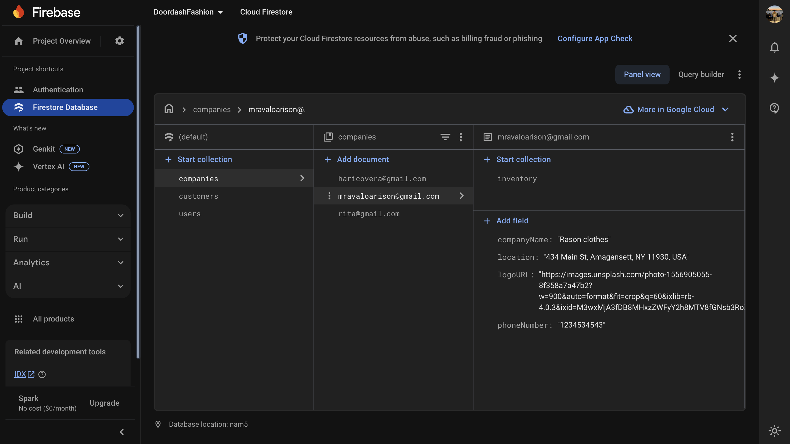

## Links

-   [Live](https://fit--finder.vercel.app)
-   [Github](https://github.com/mravaloarison/IT-495/tree/main/do_not_touch)

---
# FitFinder — Fashion Delivery & AI Styling Assistant

Built it to explore and experiment with Google's ecosystem — including `Firebase Auth`, `Firestore`, `Gemini AI`, and `Google Places API`.

The web app that lets users:

-   Browse fashion stores and their inventories
-   Order clothes, shoes, and accessories for delivery
-   Chat with an AI fashion assistant for outfit advice
-   Search locations using Google Places autocomplete


## Smart Cart Features for customer

FitFinder's cart now behaves just like you'd expect from a real e-commerce app:

-   **Increment and Decrement Items**: Users can add or remove quantities from their cart. If the count reaches zero, the item is automatically removed.
-   **Real-Time Count Sync**: Each action updates both Firestore and the UI instantly.
-   **Place Order Mode**: When users place an order, all items are marked as `Pending` in the UI, and item controls are replaced with a cancel option.
-   **Cancel Order**: Order state can be toggled off without altering Firestore data — perfect for simulating checkout states.

These additions make the cart fully interactive while preserving Firebase-backed state.

## Other Features

### Store Browser

-   Loads all registered companies from Firestore
-   When a store is clicked, fetches its inventory from:
    `companies/{email}/inventory/{category}`
-   Items are stored as fields under each category document

Example structure:

```json
{
	"Nike Hoodie": {
		"price": 45,
		"picURL": "https://example.com/hoodie.jpg"
	}
}
```

### Inventory Fetching

Each company’s inventory is flattened like this:

```ts
Object.entries(data).forEach(([itemName, value]: any) => {
	allItems.push({
		itemName,
		price: value.price,
		picURL: value.picURL,
	});
});
```


### Chat with FitFinder.AI

Powered by Gemini AI via `/api/chat`

-   Assistant gives fashion advice, style tips, outfit suggestions
-   Styled message bubbles (user vs assistant)
-   Includes avatars, timestamps, and typing animation

### Google Places Autocomplete

Handled server-side with a POST request:

```ts
const response = await fetch(
	"https://places.googleapis.com/v1/places:searchText",
	{
		method: "POST",
		headers: {
			"Content-Type": "application/json",
			"X-Goog-Api-Key": API_KEY,
			"X-Goog-FieldMask":
				"places.displayName,places.formattedAddress,places.id",
		},
		body: JSON.stringify({ textQuery: searchQuery, pageSize: 3 }),
	}
);
```

## Firebase Integration

### Firestore Console

Sample Screenshots of the Firestore console:





### User & Collection Management

**Add user to Firestore:**

```ts
await setDoc(doc(db, "users", email), userData);
```

**Check if user exists:**

```ts
const exists = (await getDoc(doc(db, "users", email))).exists();
```

**Add to Customers/Drivers/Companies:**

-   `addUserToCustomerDB(data)`
-   `addUserToDriverDB(data)`
-   `addUserToCompanyDB(data)`

**Update name/logo or location:**

```ts
updateNameAndLogo("drivers", email, { fullName, logoURL });
updateLocation("companies", email, location);
```

### Inventory Management

Add an item to a company’s inventory under a category:

```ts
await setDoc(
	doc(db, "companies", email, "inventory", category),
	{
		[itemName]: {
			price,
			picURL,
		},
	},
	{ merge: true }
);
```
